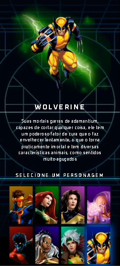

<!-- <section class="projetos" id="projetos">
      <h2 class="titulo">Meus projetos</h2>

      

        

          <a
            href="https://github.com/G1rl4nd0/Sistema-financeiro"
            target="_blank"
          >
            
            <h3>Projeto 1</h3>
            

              
Projeto feito usando HTML, CSS e JavaScript

              
🔗 Ver no GitHub Pages

            

          </a>
        

        

          <a href="https://github.com/G1rl4nd0/React-page" target="_blank">
            
            <h3>Projeto 2</h3>

            

              
Projeto feito usando HTML, CSS e JavaScript

              
🔗 Ver no GitHub Pages

            

          </a>
        

        

          <a
            href="https://github.com/G1rl4nd0/X-Men"
            target="_blank"
          >
            
            <h3>Projeto 3</h3>
            

              
Projeto feito usando HTML, CSS e JavaScript

              
🔗 Ver no GitHub Pages

            

          </a>
        

        

          <a href="https://github.com/G1rl4nd0/biblioteca-ideias" target="_blank">
            
            <h3>Projeto 4</h3>
            

              
Projeto feito usando HTML, CSS e JavaScript

              
🔗 Ver no GitHub Pages

            

          </a>
        

         

          <a href="#" target="_blank">
            
            <h3>Projeto 5</h3>
            

              
Projeto feito usando HTML, CSS e JavaScript

              
🔗 Ver no GitHub Pages

            

          </a>
        

        

          <a href="#" target="_blank">
            
            <h3>Projeto 6</h3>
            

              
Projeto feito usando HTML, CSS e JavaScript

              
🔗 Ver no GitHub Pages

            

          </a>
        

        

          <a href="#" target="_blank">
            
            <h3>Projeto 7</h3>
            

              
Projeto feito usando HTML, CSS e JavaScript

              
🔗 Ver no GitHub Pages

            

          </a>
        

        

          <a href="#" target="_blank">
            
            <h3>Projeto 8</h3>
            

              
Projeto feito usando HTML, CSS e JavaScript

              
🔗 Ver no GitHub Pages

            

          </a>
        

      

      <button class="btn-mostrar-projetos">Mostrar mais</button>
    </section> -->